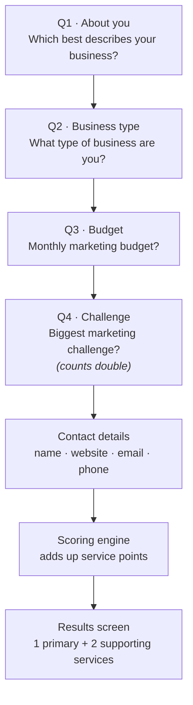
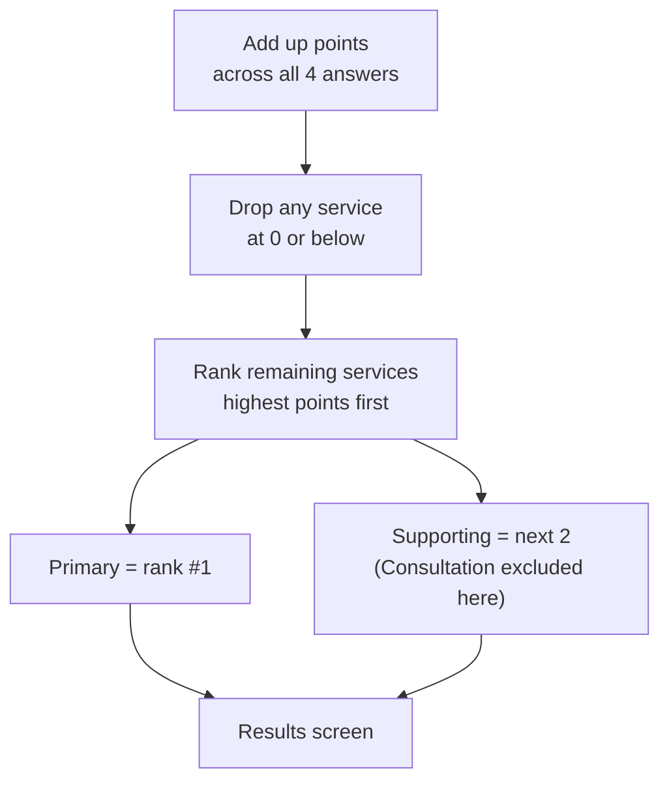

# Service Quiz — Choices & Results Overview

A plain-English map of the Move Ahead Media service quiz: every question, every
answer, the services each answer points toward, and how the final recommendation
is decided. Diagrams render on GitHub/GitLab and in most Markdown viewers.

> Source of truth: `assets/js/data.js` (copy + scoring) and `assets/js/engine.js`
> (the maths). If those change, this document should be updated to match.

---

## 1. How the quiz flows

The visitor answers **4 questions**, submits their contact details, and lands on
a results screen with **one headline service** and **two supporting services**.

Each answer adds points to one or more of the 13 services. The service with the
most points becomes the **primary recommendation**; the next two become
**supporting recommendations**. The challenge question (Q4) is weighted **×2**
because it is the strongest signal of what the customer actually needs.

---

## 2. The 13 services being scored

| ID | Service | Positioning |
|----|---------|-------------|
| `consult` | Free Strategy Consultation | Start here (only ever shown as the headline, never a support card) |
| `ai-seo` | AI SEO | Visibility in AI search |
| `seo` | SEO | Organic search |
| `local-seo` | Local SEO | Maps & near-me search |
| `google-ads` | Google Ads & Paid Media | Buy demand now |
| `cro` | Conversion Rate Optimisation | More from the same traffic |
| `web-dev` | Website Development | The asset everything runs on |
| `uxui` | UX/UI Design | Experience design |
| `content` | Content Marketing | Authority at scale |
| `social` | Social Media Marketing | Demand creation |
| `reseller` | White Label SEO | Delivery partner |
| `programmatic` | Programmatic Advertising | Scaled reach |
| `outcome` | Outcome Marketing | Performance-aligned |

When two services tie on points, the order above (top = highest priority) breaks
the tie.

---

## 3. Every choice and what it points to

Positive numbers push a service **up**; negative numbers actively rule a service
**out** (e.g. Local SEO makes no sense for a national or e-commerce brand).

### Q1 · About you — *"Which best describes your business?"*

| Answer | Services it boosts (points) |
|--------|------------------------------|
| Small Business / SME | Local SEO +2, Google Ads +2, Web Dev +1, Social +1, SEO +1 |
| In-House Marketing Team | Consultation +3, AI SEO +2, SEO +2, Google Ads +1, Content +1 |
| Enterprise / Corporate | SEO +2, AI SEO +2, Content +2, Outcome +2, Programmatic +1 |
| Agency / Consultant | White Label SEO +5, Consultation +2, AI SEO +1, SEO +1 |

### Q2 · Business type — *"What type of business are you?"*

| Answer | Services it boosts (points) |
|--------|------------------------------|
| Local Business / SME | Local SEO +3, Google Ads +2, Social +1 |
| National Brand | SEO +3, Social +2, Content +1, Programmatic +1, **Local SEO −2** |
| E-commerce Business | CRO +5, SEO +3, Google Ads +3, **Local SEO −3** |
| Enterprise Company | SEO +2, AI SEO +2, Content +2, Outcome +1, Programmatic +1, **Local SEO −2** |
| Mixed Business Model | SEO +2, Google Ads +2, Social +1, Consultation +1 |

### Q3 · Budget — *"Monthly SEO / AI / marketing budget?"*

| Answer | Services it boosts (points) |
|--------|------------------------------|
| Below THB 50,000 | Local SEO +2, Google Ads +1, Web Dev +1, Social +1, **Programmatic −3, Outcome −3** |
| THB 50,000 – 100,000 | SEO +1, Google Ads +1, Local SEO +1, **Programmatic −1, Outcome −1** |
| THB 100,001 – 300,000 | SEO +1, AI SEO +1, Content +1, Programmatic +1 |
| THB 300,001+ | AI SEO +2, Programmatic +2, Outcome +2, SEO +1, Content +1 |
| I'm not sure yet | Consultation +3 |

### Q4 · Challenge — *"Biggest marketing challenge?"* — **all points ×2**

| Answer | Services it boosts (points, before ×2) |
|--------|-----------------------------------------|
| I need more leads | Local SEO +3, Google Ads +3, CRO +2, Social +1 |
| My website doesn't rank on Google | SEO +4, Content +2, Local SEO +1, AI SEO +1 |
| My business isn't visible in AI Search | AI SEO +4, Content +2, SEO +2 |
| I need more traffic | SEO +3, Google Ads +2, Social +1, Content +1 |
| My website needs an upgrade | Web Dev +5, UX/UI +4, CRO +2 |
| I'm not sure where to start | Consultation +5, SEO +1, Google Ads +1 |

> Because Q4 is doubled, "My website needs an upgrade" alone contributes
> Web Dev +10 and UX/UI +8 — usually enough to make Web Dev the headline.

---

## 4. How the result is chosen

- **Ties** are broken by the priority order in §2 (Consultation → AI SEO → SEO → …).
- **Consultation** can be the headline recommendation but never a support card —
  it's the "we'll help you figure it out" answer, not a discrete service.
- The results screen also shows a **budget note** tailored to the Q3 answer
  (e.g. "Focused start" under THB 50k, "Enterprise" at THB 300k+).

---

## 5. Worked example

**Answers:** Small Business → Local Business → Below THB 50k → *I need more leads*

| Service | Q1 (SME) | Q2 (Local) | Q3 (<50k) | Q4 (Leads ×2) | **Total** |
|---------|:--:|:--:|:--:|:--:|:--:|
| Local SEO | +2 | +3 | +2 | +6 | **13** |
| Google Ads | +2 | +2 | +1 | +6 | **11** |
| CRO | – | – | – | +4 | **4** |
| Social | +1 | +1 | +1 | +2 | **5** |
| SEO | +1 | – | – | – | **1** |
| Web Dev | +1 | – | +1 | – | **2** |

**Result → Primary: Local SEO · Supporting: Google Ads, Social**

This is the intended path for a typical local SME chasing leads on a tight
budget: own the map pack first, buy immediate demand with Google Ads, and use
social to stay front-of-mind.
